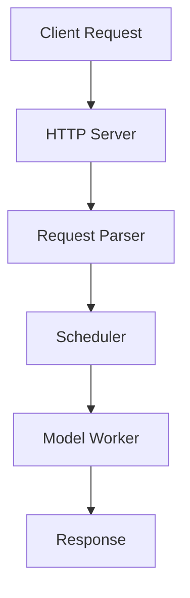
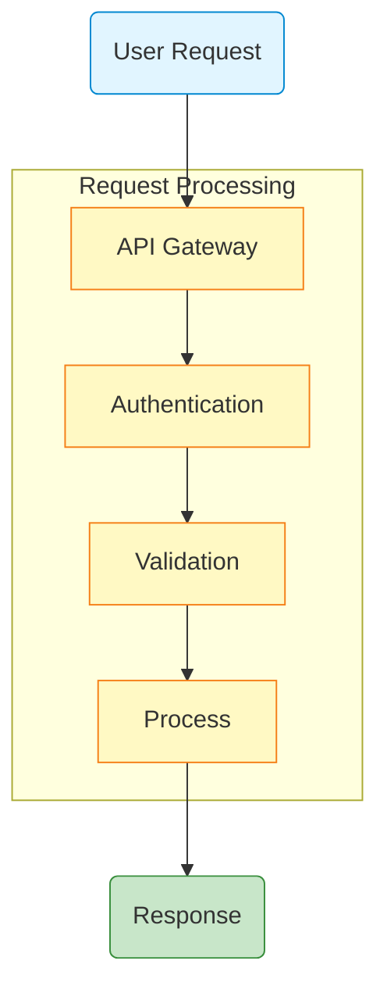
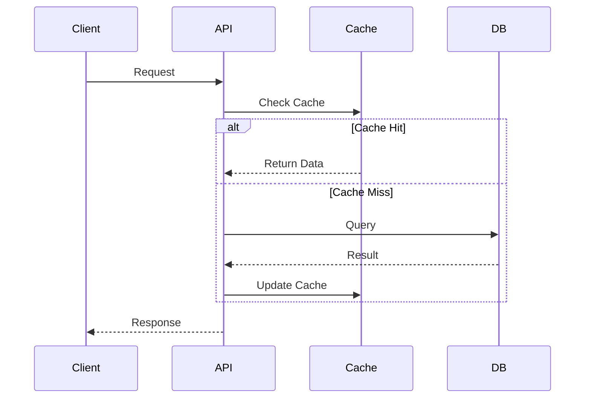
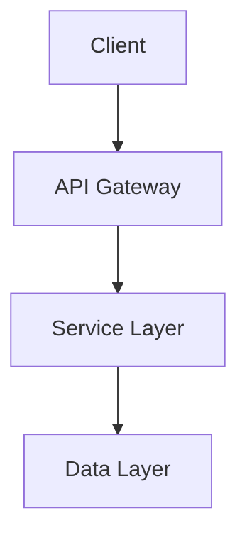

# Format Guidelines

## Source File References

### Inline Format
- Use inline code: `` `path/to/file.py` ``
- With line numbers: `` `path/to/file.py:123-456` ``
- Multiple references: `` `file1.py`, `file2.py`, `file3.py` ``

## Feature Tables

```markdown
| Feature/Component | Implementation | Key Classes/Functions | File Location |
|-------------------|----------------|----------------------|---------------|
| Name | Description | `ClassName`, `function_name` | `path/to/file.py:123-456` |
```

## Mermaid Diagrams

### Diagram Types

| Type | Syntax | Use For |
|------|--------|---------|
| Component relationships | `graph TB` or `graph LR` | Architecture, dependencies |
| Request flows | `sequenceDiagram` | Interactions, API calls |
| Decision trees | `flowchart` | Logic flows, pipelines |
| State machines | `stateDiagram-v2` | State transitions |

Keep diagrams focused: split a diagram once it grows past ~15 nodes (the
DeepWiki app renders diagrams into a 500px-tall card — oversized ones scale
down small). Prefer `graph LR` for wide component graphs.

### Grammar and Syntax Rules (CRITICAL)

1. **Node IDs**: Alphanumeric without spaces
   - ✅ `NodeA`, `Node1`, `Init_Probe`
   - ❌ `Node One`, `My Node`

2. **Labels**: Use square brackets
   - `A[Label Text]`
   - `A["Text with: special, chars"]` (quote special chars)

3. **Arrows**:
   - Solid: `-->` or `-->|label text|`
   - Dotted: `-.->` or `-.->|label text|`
   - Thick: `==>` or `==>|label text|`

4. **Subgraphs**:
   ```
   subgraph SubgraphName [Display Title]
       direction TB
       Node1 --> Node2
   end
   ```

5. **Comments**: Use `%%` for comments

6. **Styling**:
   ```
   classDef className fill:#color,stroke:#color
   A:::className
   ```

### Common Pitfalls

| Wrong | Correct | Issue |
|-------|---------|-------|
| `Node One` | `NodeOne` | Spaces in ID |
| `A[Label` | `A[Label]` | Missing bracket |
| `end` as ID | `EndNode` | Reserved keyword |
| `()` in ID | `A[Text ()]` | Parens only in labels |

### Basic Example



### Advanced Example with Styling



### Sequence Diagram Example



## Code Snippets

### Guidelines

- **4-10 snippets per major section**
- **5-15 lines each** (max 20)
- **Always attribute** with the `From:` header line — Task 7 verifies these
  mechanically against the repo
- **Quote verbatim**: never add, edit, or remove comments inside an
  attributed snippet — explanation belongs in the surrounding prose.
  Elide with a bare `# ...` line when you must shorten.

### Attribution Grammar

First line inside the fence, using the language's comment token:

```
# From: path/to/file.py:123-135            single range
// From: src/gateway/auth.ts:30-42         single range (JS/TS)
# From: README.md:46-49, :62-63, :79       multiple ranges, path inherited
```

### Example Format

```python
# From: path/to/scheduler.py:123-135
class Scheduler:
    def get_next_batch(self):
        return self.policy.select(self.queue)
```

### Cover Different Scenarios

1. Main pattern implementation
2. Alternative approaches
3. Error handling
4. Configuration examples
5. Integration points

### What to Avoid

- Large code blocks without explanation
- Code snippets > 20 lines
- Dumping entire files or classes
- Code without context

## Cross-References

- Link to other pages by FILE ONLY: `[Section Name](filename.md)` — the
  app does not navigate cross-file anchors (`filename.md#anchor` breaks).
- Same-page jumps may use `#anchor`; the heading ID is the heading text
  with formatting stripped, lowercased, non-word chars (ASCII) removed,
  spaces → `-` (e.g. `## Request Flow & Batching` → `#request-flow--batching`).
- Use descriptive text, not "click here"

## Math and Formulas

The app has no LaTeX/KaTeX support — `$x$` and `$$...$$` render literally.
Write formulas as code spans or Unicode: `x ∈ [0, 1]`, `O(n log n)`,
`a·v² + b`. For derivations, quote the source code that implements them
instead of typesetting the math.

## Metadata and Attribution

Each file should start with:

```markdown
# Section Title

**Part of**: [Architecture Documentation](index.md)
**Generated**: [timestamp]
**Source commit**: [hash]

---
```

## Image Integration

### Directory Structure

All images live in `img/` under the resolved output root (default
`.deepwiki/<project-name>/` — see SKILL.md's output-root resolution):

```
.deepwiki/<project-name>/
├── img/
│   ├── architecture-diagram.png
│   ├── request-flow.svg
│   └── component-chart.png
├── index.md
└── ...
```

### Copying Images from Project

```bash
mkdir -p ".deepwiki/<project-name>/img"

# Copy architecture diagrams (exclude prior exports and .paper inputs)
find . -type f \( -iname "*architecture*.png" -o -iname "*diagram*.png" \) \
  | grep -v "node_modules\|\.git\|\.deepwiki\|\.paper" \
  | xargs -I {} cp {} ".deepwiki/<project-name>/img/"
```

Give every image a **descriptive, unique basename** (`rl-framework.png`,
not `diagram.png`) — the upload API matches refs by basename, extension-blind,
and silently renames collisions, which breaks the markdown reference.

### Reference Format

```markdown

*Figure 1: High-level system architecture*
```

### Best Practices

| Practice | Reason |
|----------|--------|
| Prefer local copies | Ensures availability |
| Use web links for large files | Reduces repo size |
| Add descriptive alt text | Accessibility |
| Use SVG for diagrams | Scalable, smaller |
| Name with prefixes | `arch-overview.png`, `flow-request.svg` |

### Integration Guidelines

1. Review discovered images from scanning
2. Identify architecture-relevant images
3. Copy local or use web links
4. Reference in appropriate sections
5. Add descriptive captions

### Example Integration

```markdown
## System Architecture

The system follows a multi-tier architecture.


*Figure 1: High-level system architecture (from project documentation)*


*Figure 2: Detailed component interaction flow*
```

## Academic Honesty

- Never fabricate components or features
- Always verify code claims by reading source files
- When docs and code conflict, document the CODE
- Use conservative estimates when exact numbers unavailable

## Enforcement

- Each major section must analyze 5-10 actual source files
- Include specific function names, class names, implementation details
- Provide concrete examples from codebase
- Include line number references for specific code claims
