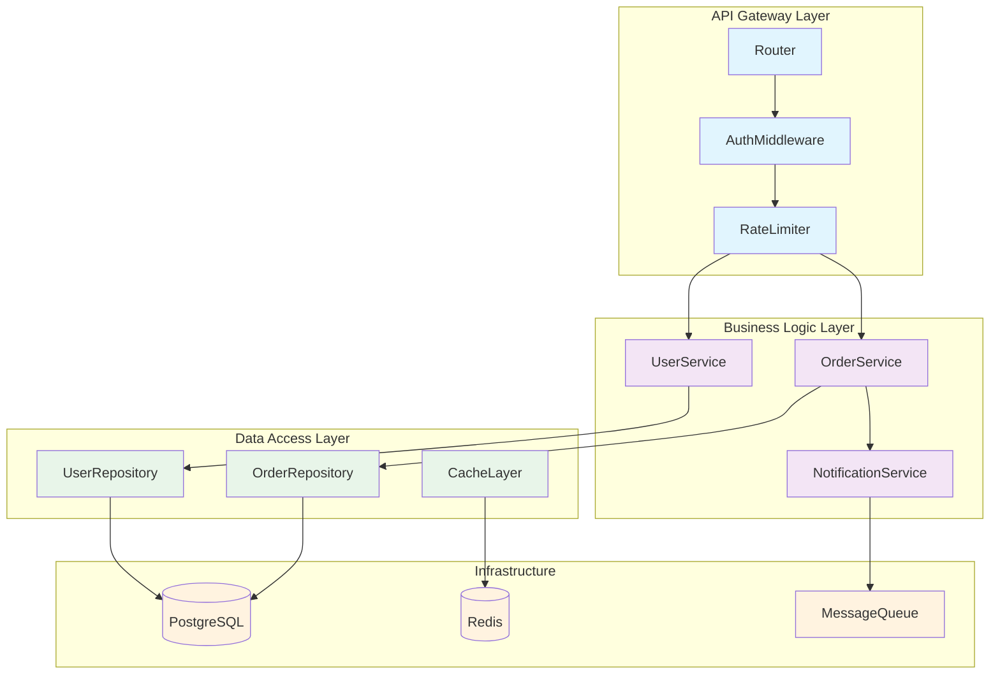

# Output Structure Examples

## Directory Structure Pattern

```
docs/<project-name>/
├── index.md                # Master TOC (GENERATE FIRST)
├── img/                    # Images directory
│   ├── architecture.png    # Copied from project
│   └── flow-diagram.svg    # Architecture visuals
├── adr/                    # Architecture Decision Records
│   ├── 0001-initial-architecture.md
│   └── 0002-database-choice.md
├── 01-overview.md          # First section
├── 02-architecture.md      # Second section
├── 03-...                  # Subsequent sections
└── ...
```

## File Naming Conventions

- Use numbered prefixes: `01-`, `02-`, ... `10-`, `11-`
- Use kebab-case after prefix: `01-overview.md`, `02-system-architecture.md`
- ADRs use `NNNN-decision-title.md` format (e.g., `0001-use-postgres.md`)
- Numbers provide clear ordering and navigation

## Example 1: ML Inference Engine (sglang)

```
docs/sglang/
├── index.md
├── img/
│   ├── architecture-diagram.png
│   ├── request-flow.svg
│   └── performance-chart.png
├── adr/
│   ├── 0001-multi-process-architecture.md
│   ├── 0002-kv-cache-design.md
│   └── 0003-scheduling-policy.md
├── 01-overview.md
├── 02-installation.md
├── 03-system-architecture.md
├── 04-request-processing.md
├── 05-memory-management.md
├── 06-distributed-execution.md
├── 07-model-execution.md
├── 08-programming-interfaces.md
├── 09-kernel-library.md
├── 10-deployment.md
├── 11-testing.md
└── 12-roadmap.md
```

**Table of Contents (index.md):**
- Overview
- Installation and Setup
- System Architecture
  - Multi-Process Architecture and IPC
  - Request Scheduling and Batching
  - Memory Management and HiCache
- Model Execution
  - Model Configuration and Loading
  - Attention Mechanisms and Backends
- Programming Interfaces
  - Python Engine API
  - HTTP Server and OpenAI API
- ...

## Example 2: Communication Library (deepep)

```
docs/deepep/
├── index.md
├── img/
│   ├── communication-model.svg
│   └── buffer-system.png
├── adr/
│   ├── 0001-communication-protocol.md
│   └── 0002-buffer-strategy.md
├── 01-overview.md
├── 02-getting-started.md
├── 03-architecture.md
├── 04-communication-kernels.md
├── 05-runtime-system.md
├── 06-hardware-integration.md
├── 07-python-api.md
├── 08-testing.md
└── 09-performance-analysis.md
```

**Table of Contents:**
- Overview
- Getting Started
  - Installation
  - Build System
- Architecture
  - System Overview
  - Communication Model
  - Buffer System
- Communication Kernels
  - Intranode Kernels
  - Internode Kernels
  - Low-Latency Kernels
- ...

## Example 3: Web API Service (myapi)

```
docs/myapi/
├── index.md
├── img/
│   ├── api-flow.png
│   ├── database-schema.svg
│   └── deployment-diagram.png
├── adr/
│   ├── 0001-api-versioning.md
│   ├── 0002-authentication-method.md
│   └── 0003-database-choice.md
├── 01-overview.md
├── 02-getting-started.md
├── 03-system-architecture.md
├── 04-api-design.md
├── 05-data-layer.md
├── 06-business-logic.md
├── 07-infrastructure.md
├── 08-security.md
├── 09-monitoring.md
├── 10-testing.md
└── 11-evolution.md
```

**Table of Contents:**
- Overview
- Getting Started
- System Architecture
  - High-Level Design
  - Component Overview
  - Data Flow
- API Design
  - REST Endpoints
  - Authentication
  - Rate Limiting
- Data Layer
  - Database Schema
  - ORM Models
  - Migrations
- ...

## Example 4: CLI Tool (mybuild)

```
docs/mybuild/
├── index.md
├── img/
├── adr/
│   ├── 0001-plugin-architecture.md
│   └── 0002-config-format.md
├── 01-overview.md
├── 02-installation.md
├── 03-architecture.md
├── 04-command-system.md
├── 05-plugin-system.md
├── 06-configuration.md
└── 07-testing.md
```

**Table of Contents:**
- Overview
- Installation
- Architecture Overview
- Command System
  - Command Registry
  - Argument Parsing
  - Plugin System
- Core Functionality
  - Build Pipeline
  - Dependency Resolution
  - Task Execution
- ...

## Index File Template

```markdown
# [Project Name] Architecture Documentation

Last indexed: [date] ([commit hash])

---

## Overview

## System Architecture
- [Subsection 1](02-system-architecture.md#subsection-1)
- [Subsection 2](02-system-architecture.md#subsection-2)

## Component Name
- [Feature A](03-component.md#feature-a)
- [Feature B](03-component.md#feature-b)

## Programming Interfaces
- [Python API](04-interfaces.md#python-api)
- [REST API](04-interfaces.md#rest-api)

## Testing
- [Test Framework](05-testing.md)

## Project Evolution
- [Roadmap](06-evolution.md)
```

## Key Principles

| Principle | Description |
|-----------|-------------|
| Flexible | Structure adapts to codebase |
| Numbered | Zero-padded prefixes for ordering |
| Descriptive | Clear file names after prefix |
| Hierarchical | Group related topics |
| No forced structure | Only create needed files |
| Image directory | Always include `img/` |

## Complete Section File Example

Below is a structurally complete example showing all required elements in a single section file. Actual sections must meet the 1500-word minimum requirement — this example is abbreviated to show the template.

````markdown
[<-Back to Index](index.md)

**Part of**: [MyAPI Architecture Documentation](index.md)
**Generated**: 2025-10-15T14:30:00Z
**Source commit**: a1b2c3d

# System Architecture

## Introduction

MyAPI follows a layered architecture pattern that separates concerns across four primary tiers: API gateway, business logic, data access, and infrastructure. This design was chosen to enable independent scaling of each layer and to maintain clear boundaries between domain logic and transport mechanisms.

The architecture evolved from a monolithic Express.js application to the current modular design during the v2.0 migration, driven by the need to support both REST and GraphQL interfaces without duplicating business logic.

## Architecture Overview



## Key Concepts

The gateway layer handles all cross-cutting concerns — authentication, rate limiting, request validation, and response formatting — before requests reach the business logic. This pattern ensures that service implementations remain focused on domain behavior rather than infrastructure plumbing.

Each service in the business layer operates on domain entities and emits domain events. Services communicate through a message queue for asynchronous operations (notifications, audit logging) while using direct method calls for synchronous workflows.

The data access layer uses the repository pattern to abstract database operations. Each repository exposes a domain-specific interface while internally handling query construction, connection pooling, and cache invalidation through the shared CacheLayer.

## Implementation Details

| Component | File Location | Key Methods | Responsibility |
|-----------|---------------|-------------|----------------|
| Router | `src/gateway/router.ts:15-89` | `registerRoutes()`, `handleRequest()` | Route dispatch and middleware chain |
| AuthMiddleware | `src/gateway/auth.ts:22-67` | `validateToken()`, `refreshSession()` | JWT validation, session management |
| UserService | `src/services/user.ts:10-145` | `createUser()`, `updateProfile()` | User lifecycle management |
| OrderService | `src/services/order.ts:8-203` | `placeOrder()`, `cancelOrder()` | Order processing and state transitions |

## Code References

Authentication middleware validates JWT tokens and attaches user context to the request:

```typescript
// From: src/gateway/auth.ts:30-42
export async function validateToken(req: Request): Promise<UserContext> {
  const token = req.headers.authorization?.replace('Bearer ', '');
  if (!token) throw new AuthError('Missing token');

  const decoded = await jwt.verify(token, config.jwtSecret);
  const user = await userRepo.findById(decoded.sub);
  if (!user) throw new AuthError('User not found');

  return { userId: user.id, roles: user.roles };
}
```

The repository pattern abstracts database queries behind a domain interface:

```typescript
// From: src/data/user-repository.ts:18-32
export class UserRepository {
  async findById(id: string): Promise<User | null> {
    const cached = await this.cache.get(`user:${id}`);
    if (cached) return cached;

    const user = await this.db.query('SELECT * FROM users WHERE id = $1', [id]);
    if (user) await this.cache.set(`user:${id}`, user, TTL.SHORT);
    return user;
  }
}
```

## Source References

- Gateway layer: `src/gateway/` (router, auth, rate-limiter, validation)
- Service layer: `src/services/` (user, order, notification, payment)
- Data access: `src/data/` (repositories, cache, migrations)
- Configuration: `src/config/index.ts:1-85`

## Summary

The layered architecture provides clear separation of concerns, enabling independent testing and scaling of each tier. The gateway pattern centralizes cross-cutting concerns, while the repository pattern with caching reduces database load. For details on the API design decisions, see [API Design](04-api-design.md). For the data layer schema, see [Data Layer](05-data-layer.md).
````

## Project Name Detection

Priority order:
1. `basename $(pwd)` - Directory name
2. Package manifest:
   - `package.json` → `name` field
   - `pyproject.toml` → `[project] name`
   - `Cargo.toml` → `[package] name`
   - `go.mod` → module name
