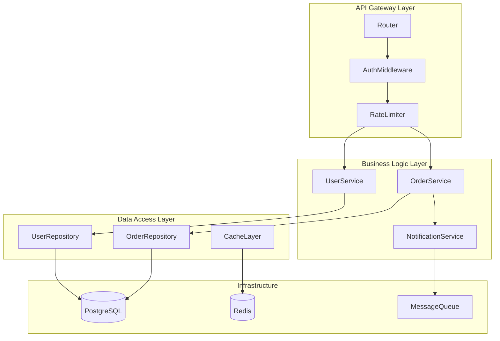

# Output Structure Examples

## Directory Structure Pattern

```
.deepwiki/<project-name>/            ← resolved output root (see SKILL.md; a host
├── index.md                         #   project may override the staging root)
├── img/                             # image assets, uploaded in the same batch
│   ├── architecture.png             # copied from project (descriptive basename)
│   └── request-flow.svg
├── 1-overview.md                    # first section
├── 2-system-architecture.md         # second section
├── 2-1-request-flow.md              # numbered child of section 2
├── 3-...                            # subsequent sections
├── 9-architecture-decisions.md      # ADR index (N = its section number)
├── 9-1-adr-multi-process.md         # ADR children — flat, never an adr/ subdir
└── 9-2-adr-kv-cache-design.md
```

Every `.md` file lives FLAT at the export root. The upload API flattens
subdirectory paths (`adr/x.md` → `adr-x.md`), which breaks every internal
link to them — only `img/` holds non-markdown assets.

## File Naming Conventions

- Use **un-padded** numbered prefixes: `1-`, `2-`, ... `10-`, `11-`.
  Sidebar sorting is numeric (`2-` before `10-`), so zero-padding is never
  needed. Stay un-padded for consistency with labels and links.
- Use kebab-case after the prefix, starting with a **lowercase letter**:
  `1-overview.md`, `2-system-architecture.md`.
- Numbered children of a section repeat its number: `2-1-request-flow.md`,
  `2-2-batching.md` group and indent under `2-system-architecture.md`.
- ADRs are numbered children of the ADR section: `N-M-adr-<slug>.md`
  (e.g., `9-1-adr-use-postgres.md` where 9 is the ADR section's number).
- The sidebar derives labels from filenames: `2-1-request-flow.md` →
  "2.1 Request Flow". Choose slugs that title-case well.

## Example 1: ML Inference Engine (sglang)

```
.deepwiki/sglang/
├── index.md
├── img/
│   ├── sglang-architecture.png
│   ├── sglang-request-flow.svg
│   └── sglang-performance.png
├── 1-overview.md
├── 2-installation.md
├── 3-system-architecture.md
├── 3-1-multi-process-ipc.md
├── 3-2-request-scheduling.md
├── 4-memory-management.md
├── 5-distributed-execution.md
├── 6-model-execution.md
├── 7-programming-interfaces.md
├── 8-kernel-library.md
├── 9-deployment.md
├── 10-testing.md
├── 11-architecture-decisions.md
├── 11-1-adr-multi-process-architecture.md
├── 11-2-adr-kv-cache-design.md
├── 11-3-adr-scheduling-policy.md
└── 12-project-evolution.md
```

**Table of Contents (index.md)** — link by file only, never `file.md#anchor`:
- [Overview](1-overview.md)
- [Installation and Setup](2-installation.md)
- [System Architecture](3-system-architecture.md)
  - [Multi-Process Architecture and IPC](3-1-multi-process-ipc.md)
  - [Request Scheduling and Batching](3-2-request-scheduling.md)
- [Memory Management and HiCache](4-memory-management.md)
- [Model Execution](6-model-execution.md)
- [Programming Interfaces](7-programming-interfaces.md)
- ...

## Example 2: Communication Library (deepep)

```
.deepwiki/deepep/
├── index.md
├── img/
│   ├── deepep-communication-model.svg
│   └── deepep-buffer-system.png
├── 1-overview.md
├── 2-getting-started.md
├── 3-architecture.md
├── 4-communication-kernels.md
├── 5-runtime-system.md
├── 6-hardware-integration.md
├── 7-python-api.md
├── 8-testing.md
├── 9-performance-analysis.md
├── 10-architecture-decisions.md
├── 10-1-adr-communication-protocol.md
└── 10-2-adr-buffer-strategy.md
```

**Table of Contents:**
- Overview
- Getting Started (installation, build system)
- Architecture (system overview, communication model, buffer system)
- Communication Kernels (intranode, internode, low-latency)
- ...

## Example 3: Web API Service (myapi)

```
.deepwiki/myapi/
├── index.md
├── img/
│   ├── myapi-flow.png
│   ├── myapi-database-schema.svg
│   └── myapi-deployment.png
├── 1-overview.md
├── 2-getting-started.md
├── 3-system-architecture.md
├── 4-api-design.md
├── 5-data-layer.md
├── 6-business-logic.md
├── 7-infrastructure.md
├── 8-security.md
├── 9-monitoring.md
├── 10-testing.md
├── 11-architecture-decisions.md
├── 11-1-adr-api-versioning.md
├── 11-2-adr-authentication-method.md
├── 11-3-adr-database-choice.md
└── 12-project-evolution.md
```

## Example 4: CLI Tool (mybuild)

```
.deepwiki/mybuild/
├── index.md
├── img/
├── 1-overview.md
├── 2-installation.md
├── 3-architecture.md
├── 4-command-system.md
├── 5-plugin-system.md
├── 6-configuration.md
├── 7-testing.md
├── 8-architecture-decisions.md
├── 8-1-adr-plugin-architecture.md
└── 8-2-adr-config-format.md
```

Smaller project → fewer, merged sections (see the merge-don't-pad rule in
SKILL.md Task 3). Don't manufacture sections to imitate a bigger example.

## Example 5: Paper-Release Repo (real shape, abbreviated)

A research-code release with a `.paper/` folder and a companion recipes
repo produced this verified export:

```
.deepwiki/alpamayo-r1/
├── index.md
├── img/
│   ├── paper-fig1-architecture.png   # paper figure, attributed + divergence note
│   └── rl-framework.png              # repo asset
├── 1-overview.md
├── 2-system-architecture.md
├── 3-vlm-reasoning-and-token-fusion.md
├── ...
├── 8-post-training-recipes.md        # nested companion repo gets its own cluster
├── 8-1-supervised-fine-tuning.md
├── 8-2-rl-post-training-grpo.md
├── 9-paper-vs-implementation.md      # required when .paper/ exists
├── 10-architecture-decisions.md
├── 10-1-adr-dual-pathway-vla.md
├── ...
└── 11-project-evolution.md
```

## Index File Template

The YAML frontmatter is REQUIRED (the upload API reads `title`/`slug`/
`description` from it). The byline lines sit immediately after the H1 with
nothing in between:

```markdown
---
title: MyAPI Architecture
slug: myapi-architecture
description: One-line summary shown in the wiki list.
---

# MyAPI Architecture Documentation

**Last indexed**: 2025-10-15 (commit a1b2c3d)

## Overview

One-paragraph orientation: what the system is and how to read this wiki.

## System Architecture
- [System Architecture](3-system-architecture.md)
- [Request Flow](3-1-request-flow.md)

## API Design
- [API Design](4-api-design.md)

## Data Layer
- [Data Layer](5-data-layer.md)

## Architecture Decisions
- [Architecture Decisions](11-architecture-decisions.md)

## Project Evolution
- [Project Evolution](12-project-evolution.md)
```

Link each entry to its **file** (`3-system-architecture.md`), never to
`file.md#anchor` — the app does not navigate cross-file anchors. Same-page
`#anchor` links are fine inside a page.

## Key Principles

| Principle | Description |
|-----------|-------------|
| Flexible | Structure adapts to codebase |
| Numbered | Un-padded numeric prefixes; numeric sidebar sort |
| Flat | All `.md` at export root; only `img/` as a subdirectory |
| Descriptive | Clear kebab-case names after the prefix |
| Hierarchical | `N-M-` children group under section `N` |
| No forced structure | Only create needed files; merge thin sections |
| Image directory | Always include `img/` with descriptive, unique basenames |

## Complete Section File Example

Below is a structurally complete example showing all required elements in a
single section file. Actual sections must meet the 1500-word minimum
requirement — this example is abbreviated to show the template. Note the
order: H1 first, then the metadata byline immediately after (the app styles
it as a muted caption only in that position).

````markdown
# System Architecture

**Part of**: [MyAPI Architecture Documentation](index.md)
**Generated**: 2025-10-15T14:30:00Z
**Source commit**: a1b2c3d

## Introduction

MyAPI follows a layered architecture pattern that separates concerns across four primary tiers: API gateway, business logic, data access, and infrastructure. This design was chosen to enable independent scaling of each layer and to maintain clear boundaries between domain logic and transport mechanisms.

The architecture evolved from a monolithic Express.js application to the current modular design during the v2.0 migration, driven by the need to support both REST and GraphQL interfaces without duplicating business logic.

## Architecture Overview



## Key Concepts

The gateway layer handles all cross-cutting concerns — authentication, rate limiting, request validation, and response formatting — before requests reach the business logic. This pattern ensures that service implementations remain focused on domain behavior rather than infrastructure plumbing.

Each service in the business layer operates on domain entities and emits domain events. Services communicate through a message queue for asynchronous operations (notifications, audit logging) while using direct method calls for synchronous workflows.

The data access layer uses the repository pattern to abstract database operations. Each repository exposes a domain-specific interface while internally handling query construction, connection pooling, and cache invalidation through the shared CacheLayer.

## Implementation Details

| Component | File Location | Key Methods | Responsibility |
|-----------|---------------|-------------|----------------|
| Router | `src/gateway/router.ts:15-89` | `registerRoutes()`, `handleRequest()` | Route dispatch and middleware chain |
| AuthMiddleware | `src/gateway/auth.ts:22-67` | `validateToken()`, `refreshSession()` | JWT validation, session management |
| UserService | `src/services/user.ts:10-145` | `createUser()`, `updateProfile()` | User lifecycle management |
| OrderService | `src/services/order.ts:8-203` | `placeOrder()`, `cancelOrder()` | Order processing and state transitions |

## Code References

Authentication middleware validates JWT tokens and attaches user context to the request:

```typescript
// From: src/gateway/auth.ts:30-42
export async function validateToken(req: Request): Promise<UserContext> {
  const token = req.headers.authorization?.replace('Bearer ', '');
  if (!token) throw new AuthError('Missing token');

  const decoded = await jwt.verify(token, config.jwtSecret);
  const user = await userRepo.findById(decoded.sub);
  if (!user) throw new AuthError('User not found');

  return { userId: user.id, roles: user.roles };
}
```

The repository pattern abstracts database queries behind a domain interface:

```typescript
// From: src/data/user-repository.ts:18-32
export class UserRepository {
  async findById(id: string): Promise<User | null> {
    const cached = await this.cache.get(`user:${id}`);
    if (cached) return cached;

    const user = await this.db.query('SELECT * FROM users WHERE id = $1', [id]);
    if (user) await this.cache.set(`user:${id}`, user, TTL.SHORT);
    return user;
  }
}
```

## Source References

- Gateway layer: `src/gateway/` (router, auth, rate-limiter, validation)
- Service layer: `src/services/` (user, order, notification, payment)
- Data access: `src/data/` (repositories, cache, migrations)
- Configuration: `src/config/index.ts:1-85`

## Summary

The layered architecture provides clear separation of concerns, enabling independent testing and scaling of each tier. The gateway pattern centralizes cross-cutting concerns, while the repository pattern with caching reduces database load. For details on the API design decisions, see [API Design](4-api-design.md). For the data layer schema, see [Data Layer](5-data-layer.md).
````

## Project Name Detection

Priority order:
1. `basename $(pwd)` - Directory name
2. Package manifest:
   - `package.json` → `name` field
   - `pyproject.toml` → `[project] name`
   - `Cargo.toml` → `[package] name`
   - `go.mod` → module name
